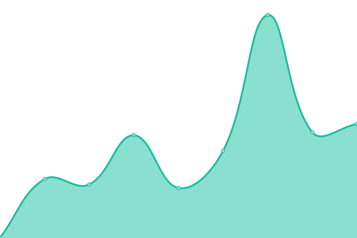
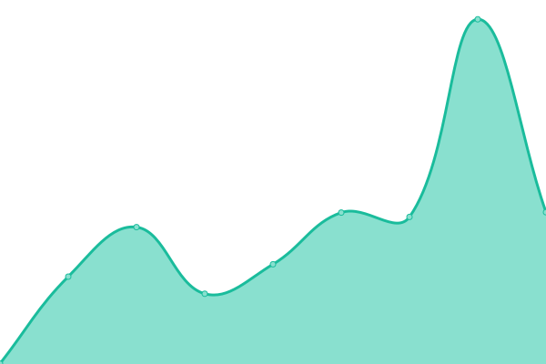

# [📈 Live Status](https://upptime.github.io/upptime): <!--live status--> **🟥 Complete outage**

This repository contains the open-source uptime monitor and status page for [Upptime](https://upptime.js.org), powered by [Upptime](https://github.com/upptime/upptime).

With [Upptime](https://upptime.js.org), you can get your own unlimited and free uptime monitor and status page, powered entirely by a GitHub repository. We use [Issues](https://github.com/upptime/upptime/issues) as incident reports, [Actions](https://github.com/sankar-shunmuga/NWP-Monitor-Tool/actions) as uptime monitors, and [Pages](https://upptime.github.io/upptime) for the status page.

<!--start: status pages-->
<!-- This summary is generated by Upptime (https://github.com/upptime/upptime) -->
<!-- Do not edit this manually, your changes will be overwritten -->
<!-- prettier-ignore -->
| URL | Status | History | Response Time | Uptime |
| --- | ------ | ------- | ------------- | ------ |
|  [LKS](https://library.hee.nhs.uk) | 🟥 Down | [lks.yml](https://github.com/sankar-shunmuga/NWP-Monitor-Tool/commits/HEAD/history/lks.yml) | 

 410ms
     
 | 

<a href="https://sankar-shunmuga.github.io/NWP-Monitor-Tool/history/lks">0.00%</a>
    

|  [Digital Transformation](https://digital-transformation.hee.nhs.uk) | 🟥 Down | [digital-transformation.yml](https://github.com/sankar-shunmuga/NWP-Monitor-Tool/commits/HEAD/history/digital-transformation.yml) | 

 423ms
     
 | 

<a href="https://sankar-shunmuga.github.io/NWP-Monitor-Tool/history/digital-transformation">0.00%</a>
    

|  [Dental](https://dental.hee.nhs.uk) | 🟥 Down | [dental.yml](https://github.com/sankar-shunmuga/NWP-Monitor-Tool/commits/HEAD/history/dental.yml) | 

 520ms
     
 | 

<a href="https://sankar-shunmuga.github.io/NWP-Monitor-Tool/history/dental">0.00%</a>
    

|  [Medical](https://medical.hee.nhs.uk) | 🟥 Down | [medical.yml](https://github.com/sankar-shunmuga/NWP-Monitor-Tool/commits/HEAD/history/medical.yml) | 

 233ms
     
 | 

<a href="https://sankar-shunmuga.github.io/NWP-Monitor-Tool/history/medical">0.00%</a>
    

|  [GP Recruitment](https://gprecruitment.hee.nhs.uk) | 🟥 Down | [gp-recruitment.yml](https://github.com/sankar-shunmuga/NWP-Monitor-Tool/commits/HEAD/history/gp-recruitment.yml) | 

 306ms
     
 | 

<a href="https://sankar-shunmuga.github.io/NWP-Monitor-Tool/history/gp-recruitment">0.00%</a>
    

|  [GP Recruitment Prod](https://gprecruitment-prod.hee.nhs.uk) | 🟥 Down | [gp-recruitment-prod.yml](https://github.com/sankar-shunmuga/NWP-Monitor-Tool/commits/HEAD/history/gp-recruitment-prod.yml) | 

 313ms
     
 | 

<a href="https://sankar-shunmuga.github.io/NWP-Monitor-Tool/history/gp-recruitment-prod">0.00%</a>
    

|  [KFH Library Services](https://kfh.libraryservices.nhs.uk) | 🟥 Down | [kfh-library-services.yml](https://github.com/sankar-shunmuga/NWP-Monitor-Tool/commits/HEAD/history/kfh-library-services.yml) | 

 646ms
     
 | 

<a href="https://sankar-shunmuga.github.io/NWP-Monitor-Tool/history/kfh-library-services">0.00%</a>
    

|  [Staging](https://staging.hee.nhs.uk) | 🟥 Down | [staging.yml](https://github.com/sankar-shunmuga/NWP-Monitor-Tool/commits/HEAD/history/staging.yml) | 

 471ms
     
 | 

<a href="https://sankar-shunmuga.github.io/NWP-Monitor-Tool/history/staging">0.00%</a>
    

|  [Webstie Testing](https://website-testing.hee.nhs.uk) | 🟥 Down | [webstie-testing.yml](https://github.com/sankar-shunmuga/NWP-Monitor-Tool/commits/HEAD/history/webstie-testing.yml) | 

 352ms
     
 | 

<a href="https://sankar-shunmuga.github.io/NWP-Monitor-Tool/history/webstie-testing">0.00%</a>
    

|  [Feedback](https://feedback.hee.nhs.uk) | 🟥 Down | [feedback.yml](https://github.com/sankar-shunmuga/NWP-Monitor-Tool/commits/HEAD/history/feedback.yml) | 

 262ms
     
 | 

<a href="https://sankar-shunmuga.github.io/NWP-Monitor-Tool/history/feedback">0.00%</a>
    

|  [Workforce Education](https://workforce-education.hee.nhs.uk) | 🟥 Down | [workforce-education.yml](https://github.com/sankar-shunmuga/NWP-Monitor-Tool/commits/HEAD/history/workforce-education.yml) | 

 244ms
     
 | 

<a href="https://sankar-shunmuga.github.io/NWP-Monitor-Tool/history/workforce-education">0.00%</a>
    

<!--end: status pages-->

[**Visit our status website →**](https://upptime.github.io/upptime)

## 📄 License

- Powered by: [Upptime](https://github.com/upptime/upptime)
- Code: [MIT](./LICENSE) © [Upptime](https://upptime.js.org)
- Data in the `./history` directory: [Open Database License](https://opendatacommons.org/licenses/odbl/1-0/)
